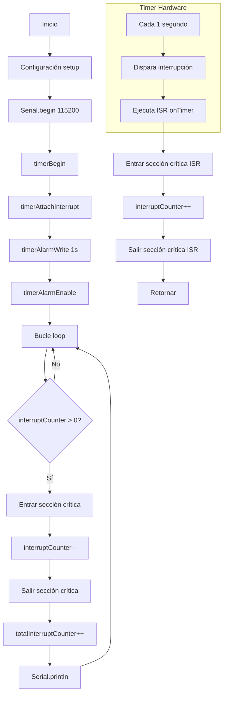
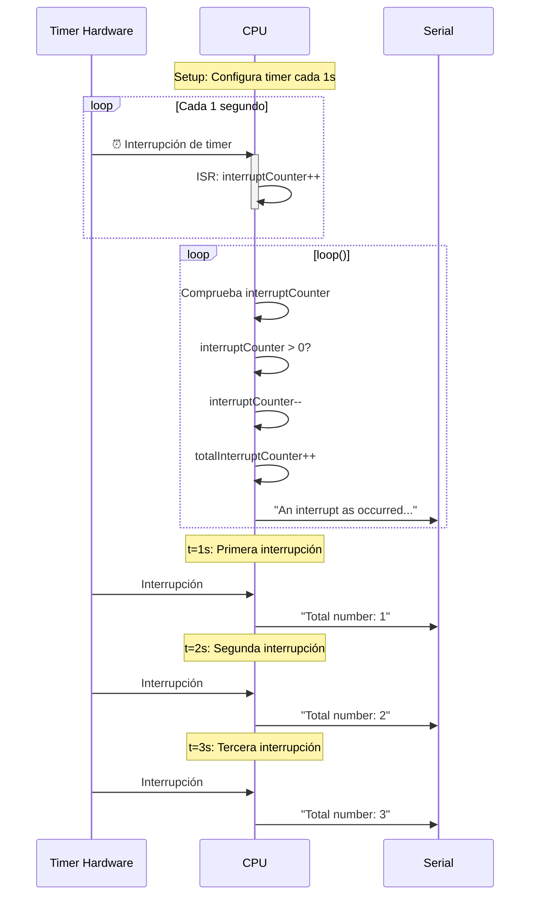

# ⏱️ Práctica 2B ESP32-S3: Interrupciones por Timer

## 📌 Introducción
Este proyecto demuestra el uso de **interrupciones por timer** en el ESP32-S3. El código configura un temporizador hardware que genera una interrupción cada segundo. En cada interrupción, se incrementa un contador y se muestra el número total de interrupciones por el monitor serie.

---

## 📋 Código Principal (main.cpp)

```cpp
#include <Arduino.h>

volatile int interruptCounter;
int totalInterruptCounter;
hw_timer_t * timer = NULL;
portMUX_TYPE timerMux = portMUX_INITIALIZER_UNLOCKED;

void IRAM_ATTR onTimer() {
    portENTER_CRITICAL_ISR(&timerMux);
    interruptCounter++;
    portEXIT_CRITICAL_ISR(&timerMux);
}

void setup() {
    Serial.begin(115200);
    
    timer = timerBegin(0, 80, true);
    timerAttachInterrupt(timer, &onTimer, true);
    timerAlarmWrite(timer, 1000000, true);
    timerAlarmEnable(timer);
}

void loop() {
    if (interruptCounter > 0) {
        portENTER_CRITICAL(&timerMux);
        interruptCounter--;
        portEXIT_CRITICAL(&timerMux);
        
        totalInterruptCounter++;
        Serial.print("An interrupt as occurred. Total number: ");
        Serial.println(totalInterruptCounter);
    }
}
```

## Diagrama de Flujo




## Diagrama de Tiempos




## Salida Monitor Serie

An interrupt as occurred. Total number: 1  
An interrupt as occurred. Total number: 2  
An interrupt as occurred. Total number: 3  
...  
